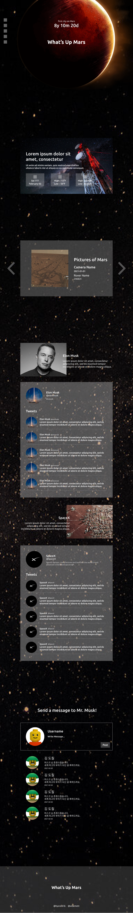

# FDS18 - Team X

[
  
## 🚀 Team X

    🧑‍🚀 김효성

    🧑‍🚀 박재운

## 💥 프로젝트 목표

지난 세 달에 걸쳐 열심히 학습한 HTML, CSS, JavaScript를 사용하여

그럴싸한 웹 서비스를 단기간에 만들어내는 것!

## 💥 프로젝트 기획

일론 머스크(Elon Musk)가 이끄는 우주수송 장비 제조업체 **Space X.**

2025년에는 인류 최초 화성 착륙을, 2030년에는 화성 도시 건설을 목표로 하고 있다.

이는 동탄 신도시 얘기가 결코 아니며, 우주에 있는 화성(Mars)이 맞다.

Team X는 일론 머스크의 도전 정신에 감명을 받아 그를 응원하는 웹사이트를 만들기로 했다.

웹사이트 이름은 **What's up Mars**.

## 💥 웹사이트 구성

1. 화성 도시를 건설할 2030년까지 **남은 날짜**
2. 가장 최근에 측정된 **화성의 날씨**
3. 화성 탐사 로봇이 찍은 3일 전 **화성의 사진**
4. @elonmusk와 @SpaceX의 최근 **트위터 멘션**
5. 일론 머스크에게 보내는 **응원 메시지**

## 💥 Tech Stacks

- [ ] HTML, Sass, JavaScript.
- [ ] Webpack, Babel.
- [ ] Express, Morgan, Needle.
- [ ] Axios, moment.
- [ ] GitFlow.

## 💥 APIs

- [ ] NASA API
- [ ] Twitter API

## 💥 Design



## 키는 법

레포지토리 클론 후

1. client 폴더에서 모듈 설치

```
npm install
```

2. server 폴더에서 모듈 설치

```
npm install
```

3. server 폴더에 `.env` 파일 생성

reddream08@gmail.com 으로 연락 주시면 알려드리겠습니다.

4. client 빌드

client 폴더에서 `npm run build` 실행

5. server 동작

server 폴더에서 `npm run dev` 실행

6. live server로 확인!
